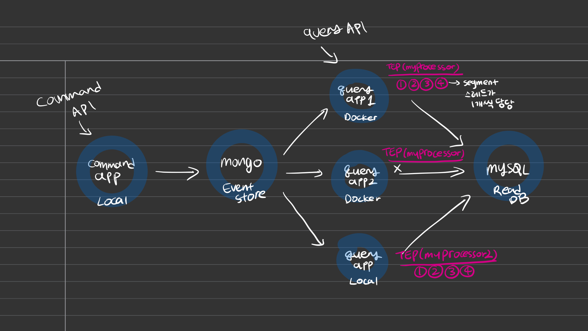
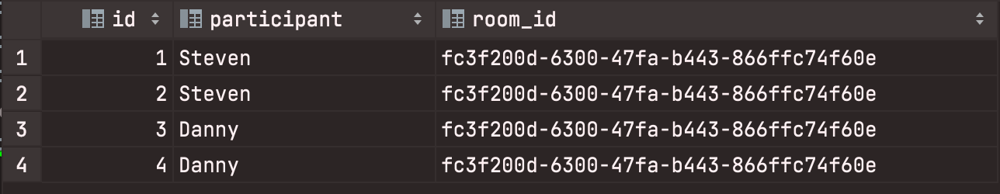
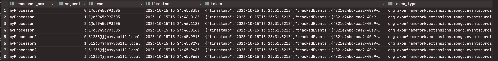

AXON PRACTICE 2
===============
### 목표
- 멀티 프로젝트 구성
- Axon TEP에 대한 이해



### 로컬 개발 환경 실행
```shell
docker-compose up -d
```
jar 파일 빌드하고 query-app 도커 이미지 빌드
```shell
./gradlew build
docker build -t query-app ./query
```
같은 도커 이미지로 query-app 2개 실행
```shell
docker run --network esdemo3_default --env-file query-app.env -e "SERVER_PORT=8082" -p 8082:8082 query-app
```
```shell
docker run --network esdemo3_default --env-file query-app.env -e "SERVER_PORT=8083" -p 8083:8083 query-app
```

### Event Processor 실험 결과
https://stackoverflow.com/questions/55629264/axon-duplicate-segment-claim-unclaimed-segments-for-multiple-nodes-and-multipl

- TEP 이름 설정 : `@ProcessingGroup`

#### 원하던 결과
같은 query-app 인스턴스 2개 실행시키면 하나의 이벤트가 로드 밸런싱 되서 둘중 하나의 app 에서만 이벤트 핸들링 되도록 하고 싶다  
```
myProcessor의 segment 개수 4개로 설정.
query-app1 = segment 0, 1 담당  
query-app2 = segment 2, 3 담당  
```
#### 실제 결과
똑같은 이름의 TEP가 하나 더 뜨면, 나중에 뜬 processor (예 query-app2) 가 모든 segment 처리 담당. (0,1,2,3)  
다른 이름의 TEP가 있으면 각각 중복으로 이벤트 처리함.


```
query-app-local (myProcessor2) = segment 0,1,2,3
query-app1 = segment 0,1,2,3
query-app2 = x
```
#### TOKEN_ENTRY


#### next
PSEP + ScheduledExecutorService 쓰면 가능...?


### Event Store
[event-bus-and-event-store](https://docs.axoniq.io/reference-guide/axon-framework/events/event-bus-and-event-store)

> Event Bus : 이벤트를 구독하고 있는 event handler로 dispatch 하는 메커니즘

#### Axon이 제공하는 4가지 Event Bus 구현체
3가지 구현체 모두 2가지 event processor 제공.
```
1. AxonServerEventStore (default)
2. EmbeddedEventStore : non-axon-server option을 위한 다양한 EventStorageEngine 제공
3. SimpleEventBus (권장 x) 
```
#### 2가지 타입의 EventProcessor
1. subscribing
   - `SubscribableMessageSource`에 등록해서 메세지 제공 받음. (예) EventBus. AMQP extension / Kafka extension)
   - 이벤트 발행하는 스레드와 Subscribing handler 호출하는 스레드가 동일.
   - **replaying x**, **parallel 실행 x**
   - 이벤트 발행 (이벤트 스토어에 저장) 과 read model 업데이트가 동시에 일어나야 할 경우는 이게 더 나은 선택지일 수도 있음.
2. streaming
   - `StreamableMessageSource`에서 메세지 제공 받음. (예) EventStore. Axon Server / RDBMS)
   - Tracing Token을 사용해서 스트림의 이벤트 핸들링할 start position으로 사용.
   - 이벤트 발행하는 스레드랑 event process 스레드 분리.
   - Tracing Token 초기화해서 처음 이벤트 부터 다시 replay 가능. 스레드가 분리되어 있어 깔끔한 병령 실행도 가능.
   - 더 유연한 시나리오 지원 (decoupling)
   - 2가지 구현체
     - TEP (Tracking Event Processor) <- **default**
     - PSEP (Pooled Streaming Event Processor) <- **recommended**

[subscribing](https://docs.axoniq.io/reference-guide/axon-framework/events/event-processors/subscribing)  
[streaming](https://docs.axoniq.io/reference-guide/axon-framework/events/event-processors/streaming)

#### TEP vs PSEP


1. open event stream
    - tep : 세그멘트 당 stream 오픈 
    - psep : stream은 한개만 open. segment worker에게 처리 위임 
2. segment claim per thread
    - tep : 스레드당 한개의 세그멘트만 처리 가능. (#segment > #thread 라면 처리 안되는 event가 생길 수 있음.)
    - psep : maxClaim 설정까지 제한 없음.
3. thread pool configuration
    - tep : 서로 다른 인스턴스간 스레드풀 공유 불가
    - psep : **`ScheduledExecutorService` 쓰면 서로 다른 프로세서 인스턴스간 executor 공유 가능**
    - https://docs.axoniq.io/reference-guide/axon-framework/deadlines/event-schedulers
